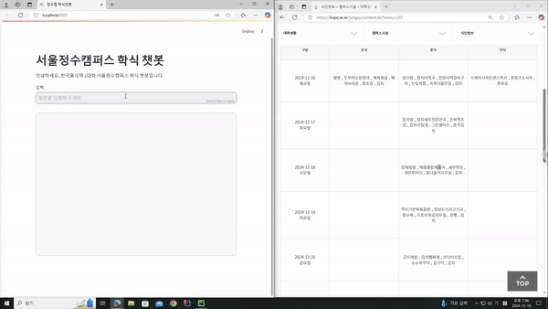

# 🥗 서울정수캠퍼스 학식 챗봇

## 📌 프로젝트 개요
서울정수캠퍼스의 학식 정보를 크롤링하여 사용자가 쉽게 학식 정보를 확인할 수 있도록 하는 **웹 기반 챗봇**입니다.  
웹 크롤링, 자연어 처리, 대화형 UI를 결합하여 실시간으로 학식 정보를 제공합니다.

---

## 📦 기술 스택
- **언어**: Python
- **웹 프레임워크**: Streamlit
- **웹 크롤러**: Selenium, BeautifulSoup
- **대화형 AI**: LangChain (ChatOllama 모델)
- **데이터베이스**: 없음 (세션 상태 저장)
- **환경**: 로컬 서버

---

## ⚙️ 주요 기능

### 1️⃣ **학식 정보 크롤링**
- **크롤링 대상**: 서울정수캠퍼스 학식 정보 웹페이지
- **사용 기술**: Selenium, BeautifulSoup
- **수행 작업**:
  - 웹페이지에 접속하여 식단 정보 및 시간표를 가져옵니다.
  - 식단과 시간을 **표 형식**으로 정리하여 반환합니다.

### 2️⃣ **챗봇 기능**
- **챗봇 UI**: Streamlit 기반의 대화형 사용자 인터페이스
- **대화 흐름**:
  - 사용자가 학식에 관한 질문을 입력합니다.
  - ChatOllama 모델이 입력 내용을 분석하여 학식 정보를 반환합니다.
  - **주말에는 학식이 제공되지 않음**을 명확히 안내합니다.

---




## 🧪 실행 방법
### 1️⃣ 환경 설정

- Python 3.9 이상이 필요합니다.
- 필요 라이브러리 설치:
```
 pip install selenium beautifulsoup4 streamlit langchain
```
### 2️⃣ 크롬 드라이버 다운로드

- Chrome 버전에 맞는 chromedriver를 설치합니다.
### 3️⃣ 프로젝트 실행

main.py를 실행하여 Streamlit 앱을 실행합니다.
```
streamlit run main.py
```
4️⃣ 웹 브라우저 접속
- 브라우저에서 http://localhost:8501에 접속하여 학식 챗봇을 사용합니다.
## 💡 개선 사항
- 에러 처리 강화: 웹페이지 변경에 따른 에러 발생 가능성을 대비한 예외처리 추가.
- 리소스 최적화: 크롬 드라이버 실행 속도 및 메모리 최적화를 위해 headless 모드를 사용 중이나, 더욱 효율적인 방법을 모색.
- 대화형 AI 개선: 현재는 LangChain의 LLM 모델을 사용하여 챗봇 응답을 생성하지만, 더 빠른 응답 속도를 위해 캐싱 기능 추가를 고려.

